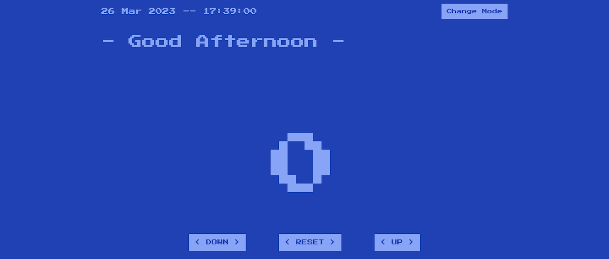
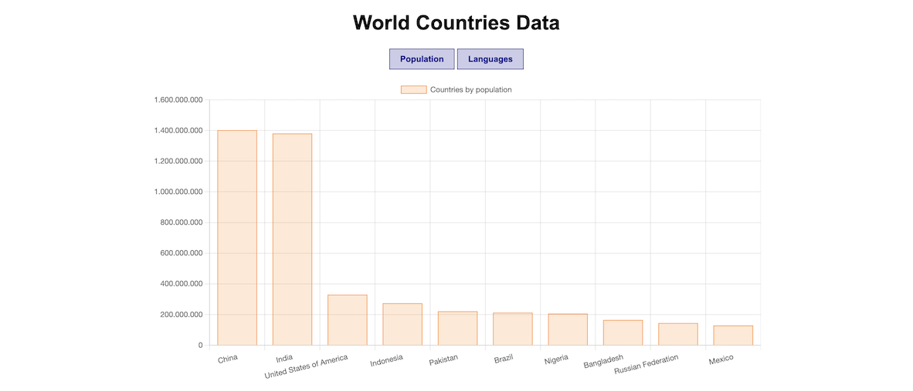
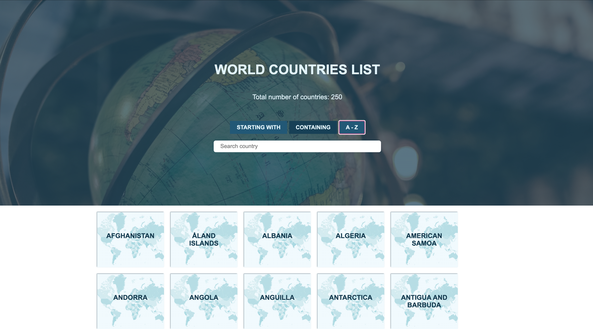

### Day 57: March 27, 2023 (MONDAY)

##### ONLINE COURSE PROJECT

**TODAY'S PROGRESS**: Worked on the second project for an online Front-end course. The base is a counter and I added an every-second-changing date, a greeting based on the hour of the day and a mode changer button.

### Day 58: March 28, 2023 (TUESDAY)

##### ONLINE COURSE PROJECT

**TODAY'S PROGRESS**: Finished up the project and submitted it.

### Day 59: March 29, 2023 (WEDNESDAY)

##### DATA VISUALIZATION PROJECT

**TODAY'S PROGRESS**: Started working on a project that requires to visualize the ten most populated countries and the ten most spoken languages in the world using DOM.

### Day 60: March 30, 2023 (THURSDAY)

##### DATA VISUALIZATION PROJECT

**TODAY'S PROGRESS**: Installed Node.js a few days ago so I used Chart.js library for the bar chart design.

### Day 61: March 31, 2023 (FRIDAY)

##### DATA VISUALIZATION PROJECT

**TODAY'S PROGRESS**: Finished up the data visualization application. The other bar chart appears When clicking on languages.

### Day 62: April 1, 2023 (SATURDAY)

##### SEARCH APPLICATION FOR COUNTRIES

**TODAY'S PROGRESS**: Started working on a new project today. It consists on accurately looking for countries based on users' input. Found countries should be output into the HTML document.

The search goes by first letters, containing letters, from A to Z and from Z to A

**THOUGHTS**: Hopefully I will finish the project tomorrow so I can really chill on my vacay!

### Day 63: April 2, 2023 (SUNDAY)

##### DATA STRUCTURES

**TODAY'S PROGRESS**: Finished the application I started yesterday.

**THOUGHTS**: There has been some tricky moments here and there, such as: reverse and undo reverse with a single button and implementing the input event listeners based on button click. Overall is was interesting and now that it's finished I feel fulfilled.

